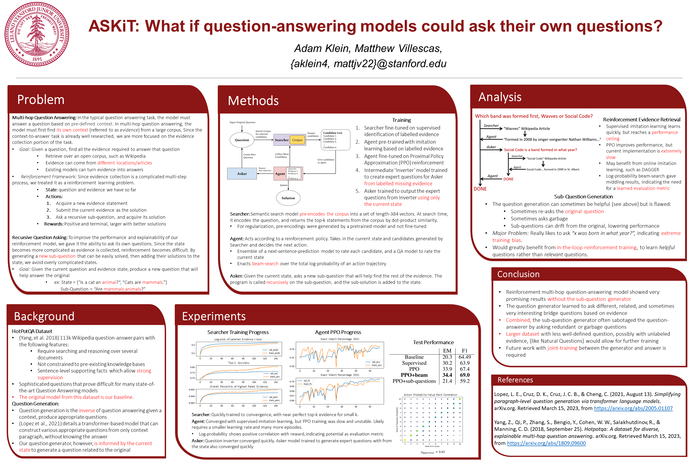

# ASKiT 

## Overview

Stanford CS224N Final Project. A text-based multi-hop reasoning question-answer NLP model to address the research question: "What if language models could ask their own questions?"

